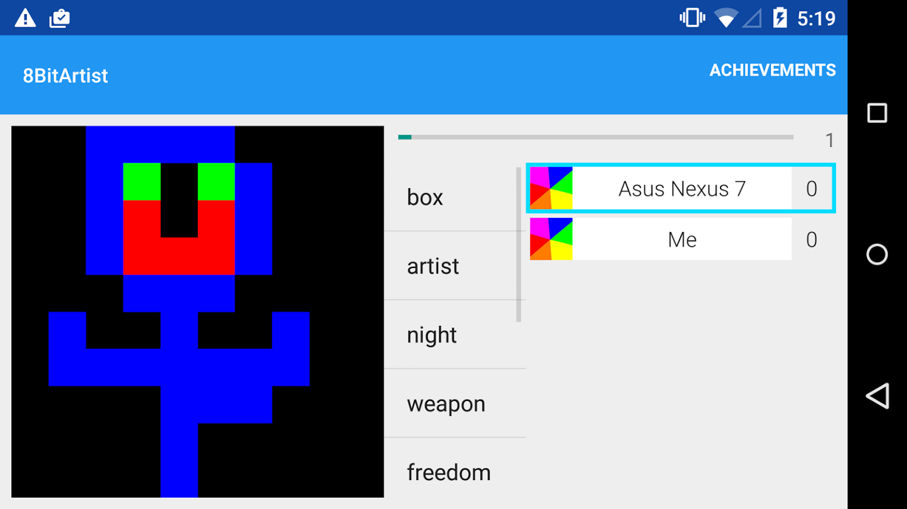

# 8 Bit Artist
8 Bit Artist is a fully-featured multiplayer game demonstrating the 
[Real-time Multiplayer](https://developers.google.com/games/services/android/realtimeMultiplayer) 
and [Nearby Connections](https://developers.google.com/games/services/android/nearby) APIs.

</img>

## Game Summary
8 Bit Artist is a multiplayer drawing game where the artist has very limited
resources: 4 colors and 10x10 pixel canvas.  The artist is given a word which
he/she attempts to draw.  It is the job of the other player(s) to guess what
is being drawn as fast as possible.  Points are awarded for guessing quickly, 
and players take turns drawing.  There are two multiplayer game modes, each 
with the same gameplay but leveraging a different API:

### Real-time Multiplayer Mode ("Online" Mode)
8 Bit Artist can be played with 2-4 players anywhere in the world using the 
Play Game Services Real-time Multiplayer API.  After signing in with your 
Google account, press the **Play Online** button to being matchmaking.  You 
can select people you know, or use automatching to find random players that 
are online.  In this mode players can leave the game at any time but you 
cannot join or re-join a game that is already in progress.  This mode also 
uses the [Achievements](https://developers.google.com/games/services/android/achievements) 
API, which rewards players for achieving certain in-game milestones.

### Nearby Connections Mode ("Party" Mode)
In party mode, you can play 8 Bit Artist against 2+ people with devices 
connected to the same WiFi network.  In this mode there is no need to sign in 
with Google and there is no server involved.  Instead, the devices connect 
directly over WiFi and send messages to each other over the local network.  In 
this mode the game has a "hop-in, hop-out" experience.  One player is the game 
"host" and initiates the game with the **Host Party** button.  All other 
players can join the game with the **Join Party** button.  Non-host players 
can join and leave the game at any time, as long as the host does not end the 
game their scores are remembered even after a disconnection.  There is also no 
theoretical limit to how many players can join in Nearby Mode, however the UI 
may not support displaying individual scores for very large numbers of players.

## Set Up
The following steps will show you how to import, build, and run this sample 
app.  These instructions assume you want to enable all features of the sample 
application.  If you are only interested in Nearby Connections and not 
interested in Sign-in with Google, Real-time Multiplayer, or Achievements, you 
can skip directly to Step #2 (Android Studio).

### 1 - The Developer Console
First, set up a project and link your app in the Developer Console.  For more 
information, visit:

[https://developers.google.com/games/services/console/enabling](https://developers.google.com/games/services/console/enabling)

Make sure to take note of the **Package Name** and **App ID** from this step.

Second, create the following five achievements in the Developer Console: 
 
| Name              | Incremental? | # of Steps |
|-------------------|--------------|------------|
| 5 Turns           | Yes          | 5          |
| 10 Turns          | Yes          | 10         |
| Started a Game    | No           | N/A        |
| Guessed Correctly | No           | N/A        |
| Got One Wrong     | No           | N/A        |

Make sure to record the **Achievement ID** for each created achievement, you 
will need them in later steps.

### 2 - Android Studio

#### Import the Project
Open Android Studio and click **File > Import Project**.  Select the directory 
where you cloned the code from this repository.

#### Modify Ids
First, open `AndroidManifest.xml` and change the application package name to 
the package name you used in the Developer Console.

Next, if you completed Step 1 and enabled Play Game Services for this sample, 
open `res/values/ids.xml` and replace each instance of `REPLACE_ME` with the 
appropriate value.  For `app_id` this is your game's app ID from the Developer 
Console, and for each of the `achievement_*` values it is the ID of the 
achievement you created with the matching name.

## Run
Build and run the game.  You will need to run the game on a physical Android 
device with Google Play Services installed.  It is recommended to build and 
run the game from Android Studio, however you can also build manually by 
running `./gradlew build` in the project directory and then installing the 
resulting application with `adb install <APK_LOCATION>`.

### Troubleshooting

  * To use Party Mode, your devices must be on the same WiFi network and the 
  network must have [multicast](http://en.wikipedia.org/wiki/Multicast_DNS) 
  enabled.

  * Make sure to sign your apk with the same certificate as the one whose 
  fingerprint you configured on Developer Console, otherwise you will see 
  errors.

  * If you are testing an unpublished game, make sure that the account you 
  intend to sign in with (the account on the test device) is listed as a 
  tester in the project on your Developer Console setup (check the list in the 
  "Testing" section), otherwise the server will act as though your project did 
  not exist and return errors.
